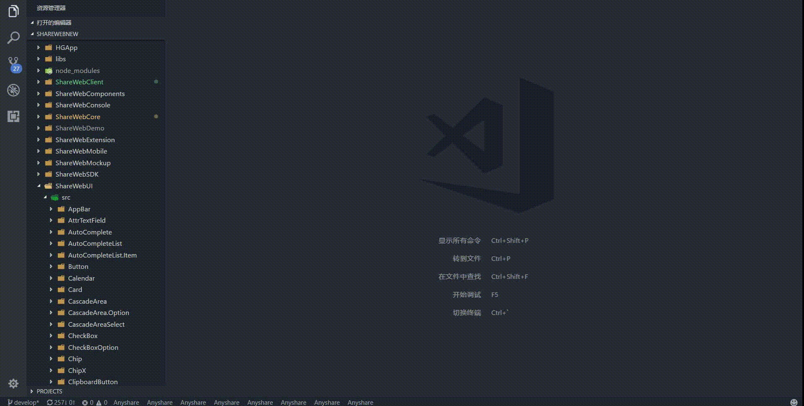

# anyshare-fe-helper

## 概述

快速创建Anyshare Web前端组件骨架结构，支持以下组件创建：

- ShareWebUtil 
- ShareWebCore 
- ShareWebUI 
- ShareWebComponents 
- ShareWebConsole

## 使用方法
`Ctrl + Shift + P`打开VSCode命令窗口，输入anyshare

## 扩展设置

This extension contributes the following settings:

* `Anyshare.ShareWebNewDir`: 自定义 ShareWebNew 根目录路径
* `AnyShare.templateDir`: 自定义 模板目录 路径

## 已知问题

- 暂不支持同时创建两个平台的组件
- 暂不支持创建子组件

## 发布记录

### 1.0.0

实现基础功能
